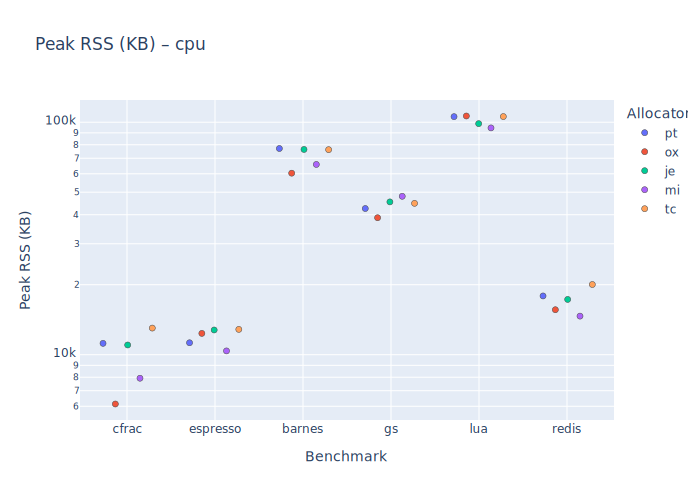
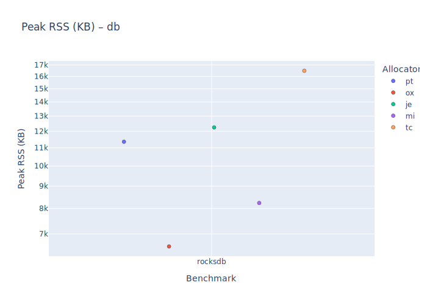
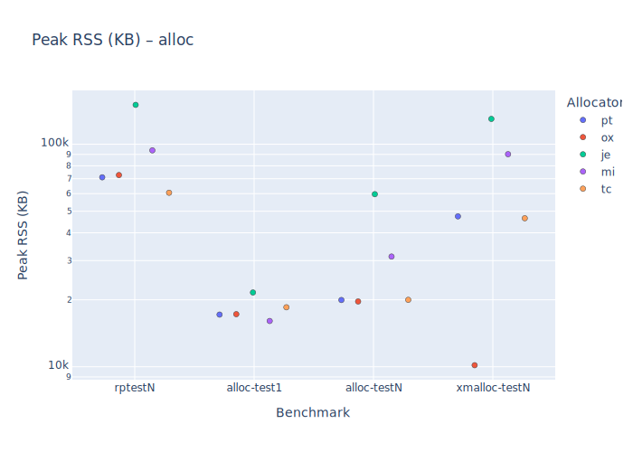
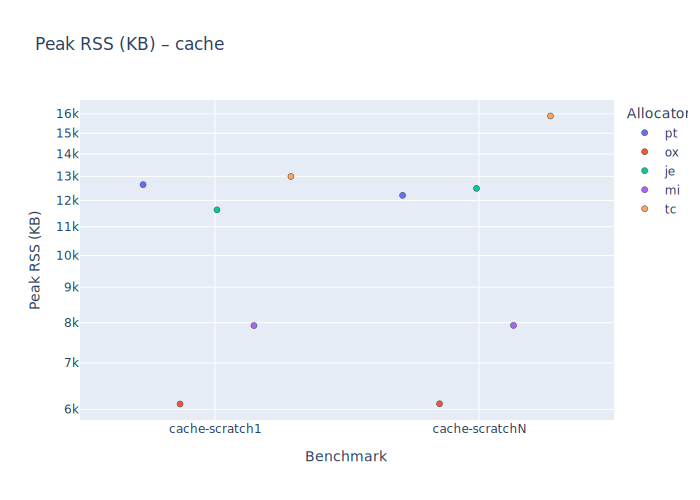
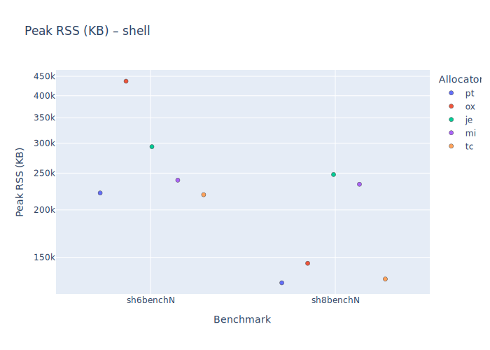
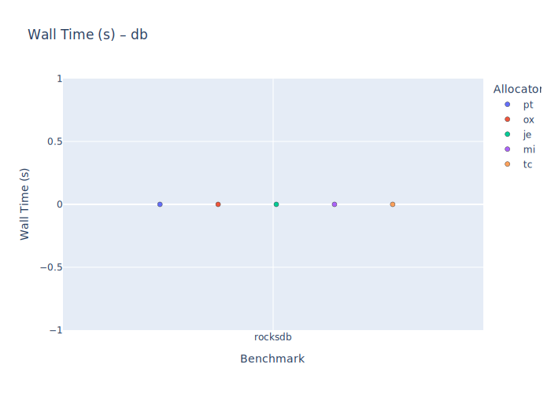
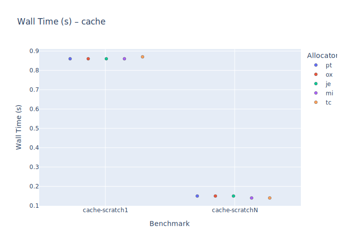
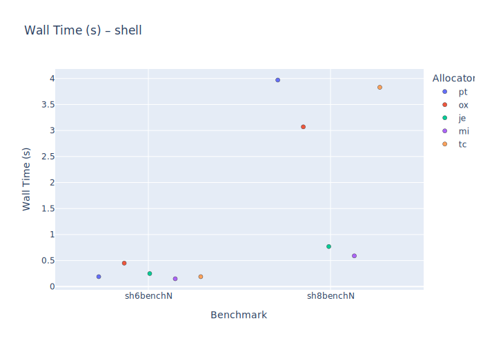

# Overview

This repository contains a comparative evaluation of modern memory allocators
using the `mimalloc-bench` test suite, with a particular focus on **memory
behavior (RSS)** and **realistic application workloads**.

The goal is not to crown a universal “fastest allocator”, but to expose
allocator **tradeoffs** under different workload classes and to highlight
design choices that matter in modern systems (containers, databases,
long-running services).

---

### Test system

- **CPU:** AMD Ryzen 5 5600X
- **Memory:** 16 GB DDR4 @ 3200 MHz CL16
- **Kernel:** Linux 6.18.8-2-cachyos
- **Distro:** CachyOS

### Methodology

- **Harness:** `mimalloc-bench` (default suite).
- **Runs:** Each allocator is evaluated via the standard harness runner; no custom patching.
- **Data:** Raw results live in `benchmarks.txt`; plots are derived from that file.

---

## What is being compared

Allocators included in these benchmarks:

- **ptmalloc** (glibc)
- **jemalloc**
- **mimalloc**
- **tcmalloc**
- **oxidalloc**

All allocators are evaluated using the same benchmark harness and environment.

---

## About the benchmarks

The test suite includes a mix of:

- **Synthetic stress tests**
- **Allocator microbenchmarks**
- **Application-like CPU workloads**
- **Database-style workloads**

Not all benchmarks are equally representative of real-world behavior.

### Important note

Most tests in this suite are **synthetic** and are designed to stress allocator
behavior, expose edge cases, or highlight worst-case scenarios. They should not
be interpreted as direct predictors of application performance.

---

## Excluded worst-case tests

The following benchmarks are intentionally excluded from the default plots:

- `mstressN`
- `larsonN-sized`

These tests are **explicitly adversarial** and are known worst cases for
allocators that prioritize tight RSS control over aggressive caching.
They intentionally defeat oxidalloc’s design goals and can dominate plots
in ways that obscure more relevant results.

The data is not hidden — these tests remain runnable and documented — but they
are not representative of real-world workloads.

---

## Results at a glance

### Peak RSS
- CPU workloads  
  

- Database workloads  
  

- Stress benchmarks  
  

- Cache benchmarks  
  

- Sheel benchmark
  

### Wall time
- CPU workloads  
  

- Database workloads  
  

- Stress benchmarks  
  

- Cache benchmarks  
  

- Shell benchmarks  
  

---

## How to interpret the results

### Realistic workloads

The most application-relevant behavior can be observed in:

- `*_cpu` benchmarks (e.g. `redis`, `lua`, `gs`)
- `*_db` benchmarks (e.g. `rocksdb`)

These workloads resemble long-running services and databases where:
- memory footprint matters
- predictable RSS is critical
- allocators run for extended periods

### Synthetic benchmarks

Allocator stress tests and microbenchmarks are useful for understanding
tradeoffs and failure modes, but should not be over-weighted when evaluating
production suitability.

---

## Key observations

Across CPU and database-style workloads:

- Oxidalloc consistently maintains **lower peak RSS**
- Performance remains **competitive with jemalloc, mimalloc, and tcmalloc**
- Memory usage is **predictable and bounded**
- Results reflect intentional design tradeoffs rather than tuning artifacts

These characteristics are particularly relevant for:
- containerized environments
- memory-constrained systems
- long-running services and databases
